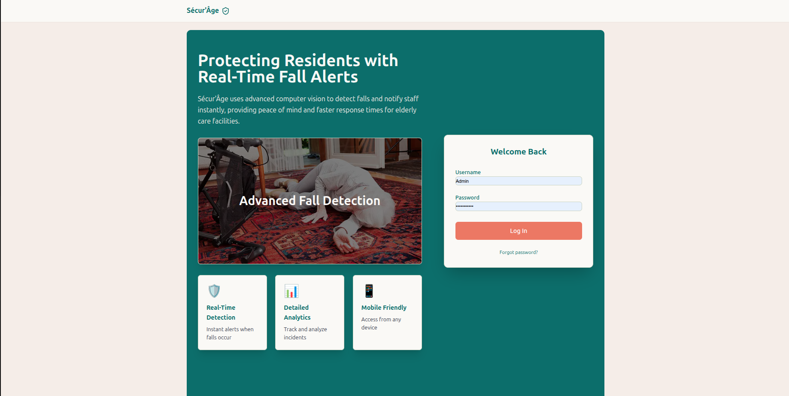

# Sécur’Âge

**Sécur’Âge** is a cutting-edge, enterprise-grade fall detection platform designed to proactively safeguard the elderly in residential care settings. Born from extensive research and rigorous testing, our solution seamlessly integrates high-performance YOLOv8 object detection with OpenCV-driven video processing to deliver real-time incident alerts and comprehensive analytics. The modular Django backend, augmented by Bolt UI components, offers a responsive dashboard for facility managers and caregivers—enabling rapid response times, data-driven insights, and customizable workflows.

Over countless development sprints, our interdisciplinary team prioritized reliability, accuracy, and scalability. We implemented robust snapshot management, secure media handling, and optional asynchronous processing via Celery/Redis to ensure continuous monitoring under diverse operational conditions. Deployed as an open-source project, Sécur’Âge empowers organizations to reduce fall-related risks through proactive detection, seamless integration, and actionable reporting.

---

## 📸 Screenshots

| Title                              | Image                                                                                               | Description                                                               |
|-------------------------------------|-----------------------------------------------------------------------------------------------------|---------------------------------------------------------------------------|
| Login Page                         |                                                            | Secure login interface prompting for test credentials; no live feed.       |
| Dashboard Overview                 |                                                | Main dashboard showcasing synthetic metrics, weekly activity chart, and recent alerts. |
| Alerts List View                   |                                                | Comprehensive alerts list displaying test-upload thumbnails and statuses.   |
| Live Detection Interface (Idle)    |                            | Live camera detection panel in idle state—awaiting operator to start feed. |
| Test Detection: No Fall Detected   |                                 | Result page showing “No Fall Detected†on a privacy-safe sample image.     |
| Test Detection: Fall Detected      |                                       | Result page with bounding box and confidence score highlighting a detected fall. |

---

## 📋 Table of Contents

1. [Features](#-features)
2. [Tech Stack](#-tech-stack)
3. [Prerequisites](#-prerequisites)
4. [Installation](#-installation)
5. [Configuration](#-configuration)
6. [Usage](#-usage)
7. [Project Structure](#-project-structure)
8. [Contributing](#-contributing)
9. [License](#-license)

---

## 🚀 Features

- **Live Fall Detection** via webcam & YOLOv8
- **Test Uploads**: analyze images/videos on demand
- **Dashboard**: real-time stats, weekly charts, response rates
- **Alerts List**: filter by date, status, source; modal preview
- **Acknowledgements & Accuracy Marking**
- **Snapshot & Clip Storage** in `media/`
- **Auto-refresh** every 30 s

---

## 🛠 Tech Stack

- **Backend:** Django + Bolt components
- **CV Model:** [Ultralytics YOLOv8](https://github.com/ultralytics/ultralytics)
- **Inference & Video I/O:** OpenCV, Pillow, NumPy
- **Frontend:** Tailwind CSS, plain JS for modals & auto-refresh
- **Optional:** Celery + Redis for background tasks
- **Database:** SQLite (dev) / PostgreSQL (prod)

---

## 📦 Prerequisites

- **Python** 3.12+
- **Poetry** (≥1.4) for dependency management & virtual environments
- A webcam (for live mode)

---

## ⚙️ Installation (with Poetry)

1. **Clone the repository**
   ```bash
   git clone https://github.com/your-org/secur-age.git
   cd secur-age
   ```
2. **Install dependencies**
   ```bash
   poetry install
   ```
3. **Activate the virtual environment**
   ```bash
   poetry shell
   ```
4. **Apply database migrations**
   ```bash
   python manage.py migrate
   ```
5. **Create a superuser**
   ```bash
   python manage.py createsuperuser
   ```
6. **Run the development server**
   ```bash
   python manage.py runserver
   ```

> If you prefer not to spawn a shell, prefix commands with `poetry run`, e.g.:
>
> ```bash
> poetry run python manage.py runserver
> ```

---

## 🔧 Configuration

- Ensure in `settings.py`:
  ```python
  MEDIA_URL = '/media/'
  MEDIA_ROOT = BASE_DIR / 'media'
  X_FRAME_OPTIONS = 'SAMEORIGIN'
  ```
- **Tailwind purge/content**\
  Include all your `templates/**/*.html` in `tailwind.config.js`’s `content` array.
- **Environment vars** (for prod):
  - `DJANGO_SECRET_KEY`
  - `DATABASE_URL`
  - `CAMERA_RTSP_URL` (if you use VideoClipService)

---

## ▶️ Usage

1. **Login** at `/accounts/login/`.
2. **Dashboard** (`/`) shows live stats & recent alerts.
3. **Alerts** (`/alerts/`):
   - Filter by date, status, source
   - Click thumbnail to open full-size snapshot in modal
4. **Test Detection** (`/test/`):
   - Upload an image or short video
   - Get immediate visual feedback & alert record

---

## 🗂️ Project Structure

```text
secur-age/
├── .env                    # Environment variables (e.g., DJANGO_SECRET_KEY)
├── .gitignore
├── .venv/                  # Poetry-managed virtual environment
├── accounts/               # User authentication
│   ├── migrations/
│   ├── templates/
│   ├── admin.py
│   ├── apps.py
│   ├── models.py
│   ├── tests.py
│   ├── urls.py
│   └── views.py
├── backend/                # Django project settings & entrypoints
│   ├── asgi.py
│   ├── settings.py
│   ├── urls.py
│   └── wsgi.py
├── detection/              # Core fall-detection app
│   ├── migrations/
│   ├── templates/detection/
│   │   ├── alerts_list.html
│   │   ├── dashboard.html
│   │   └── test_detection.html
│   ├── apps.py
│   ├── forms.py
│   ├── models.py
│   ├── services.py
│   ├── tests.py
│   ├── urls.py
│   └── views.py
├── docs/                   # Documentation & assets
│   └── screenshots/        # README screenshots (dashboard, alerts, test uploads)
├── media/                  # Stored snapshots & clips
│   └── snapshots/YYYY/MM/DD/
├── model_dl/               # Pretrained model files
│   └── best.pt
├── theme/                  # Bolt/Tailwind theme overrides
│   ├── static/css/dist/
│   │   └── styles.css
│   └── static_src/         # Source Tailwind files
├── templates/              # Project-level templates (e.g., base.html)
├── static/                 # Collected static assets
├── manage.py               # Django CLI entrypoint
├── pyproject.toml          # Poetry configuration
├── poetry.lock             # Locked dependencies
├── requirements.txt        # Optional: pinned requirements for non-Poetry workflows
├── db.sqlite3              # Development database
└── README.md               # Project overview and docs
```

---

## 🤝 Contributing

1. Fork the repo
2. Create a feature branch (`git checkout -b feat/my-feature`)
3. Commit your changes
4. Push & open a PR

Please run `poetry run black .` and `poetry run flake8` before submitting.

---

## 📄 License

Distributed under the [MIT License](LICENSE).

